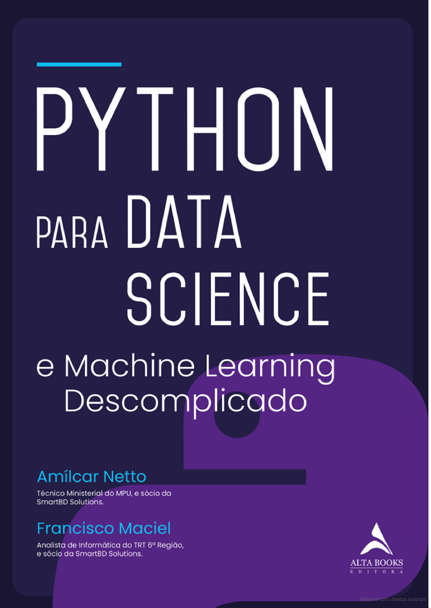

### Repositório com conteúdo de estudos do livro

## PYTHON PARA DATA SCIENCE E MACHINE LEARNING DESCOMPLICADO

Amílcar Netto
&
Francisco Maciel

#

Arquivos em `./material_apoio` fornecido pelos autores para estudo através do site da editora: <a href="https://drive.google.com/file/d/1OdaoAwBZOjBdh4tVKkO7PzjR0CdiggpB/view"> Download aqui </a>

